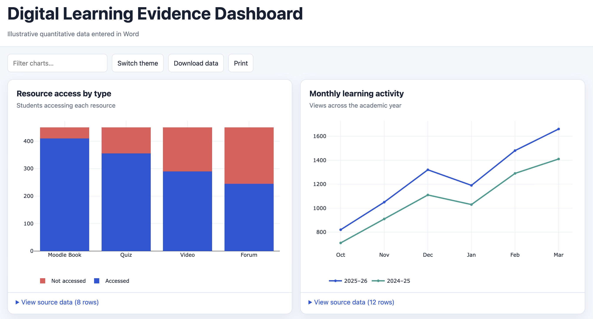

# CloudPedagogy Word Chart Dashboard Renderer

Convert editable Word tables into a responsive dashboard containing bar, line, scatter/bubble, area, pie and donut charts. Edit the supplied example and run one Python command; no Plotly or JavaScript editing is required.

## Files and demonstration

- [Editable Word example](examples/chart_dashboard_example.docx)
- [Renderer script](render_chart_dashboard.py)
- [Generated HTML example](output/chart_dashboard_example/index.html)
- [Normalised example data](output/chart_dashboard_example/data.json)
- [Example QA report](output/chart_dashboard_example/qa_report.md)
- [Automated tests](tests/test_render_chart_dashboard.py)

## Live Demo

[View the Word Chart Dashboard Renderer demo](http://cloudpedagogy-word-chart-dashboard-renderer.s3-website.eu-west-2.amazonaws.com/)

## Screenshot



## Quick start

```bash
git clone https://github.com/cloudpedagogy/cloudpedagogy-word-chart-dashboard-renderer.git
cd cloudpedagogy-word-chart-dashboard-renderer

python3 -m venv .venv
source .venv/bin/activate
python3 -m pip install -r requirements.txt

python3 render_chart_dashboard.py examples/chart_dashboard_example.docx \
  --output output/chart_dashboard_example
```

Windows PowerShell:

```powershell
py -m venv .venv
.\.venv\Scripts\Activate.ps1
py -m pip install -r requirements.txt
py render_chart_dashboard.py examples/chart_dashboard_example.docx --output output/chart_dashboard_example
```

Open `output/chart_dashboard_example/index.html`.

## Create your own dashboard

Copy [the Word example](examples/chart_dashboard_example.docx) and edit:

- `SETTINGS` — dashboard-wide title, subtitle and appearance
- `CHARTS` — one row per chart; requires chart ID and chart type
- `DATA` — one value per row; requires chart ID, X and Y

Supported types are `bar`, `line`, `scatter`, `area`, `pie` and `donut`. Optional chart fields include title, subtitle, axis labels, stacking, legend, sorting, donut hole and height. Optional data fields include series, size, label and colour.

Repeated series names create multiple traces. Scatter sizes create bubbles. Colours may use CSS names, hex, RGB or HSL.

## Customisation and limits

One document can define any number and mixture of supported charts. The offline output includes responsive layout, search, light/dark themes, tooltips, PNG export, printing, JSON download and accessible data tables.

The renderer expects long-form data in the documented schema. It does not automatically interpret arbitrary spreadsheet-like Word tables or choose chart types for the user.

## Output and validation

- `index.html` — self-contained interactive dashboard
- `data.json` — validated structured data
- `qa_report.md` — counts, warnings and errors

```bash
python3 render_chart_dashboard.py --help
python3 -m unittest discover -s tests -v
```

The renderer checks duplicate chart IDs, chart types, data references, missing X values and invalid Y values. Use `--strict` to treat warnings as failures.

## Licence

MIT. See [LICENSE](LICENSE).
